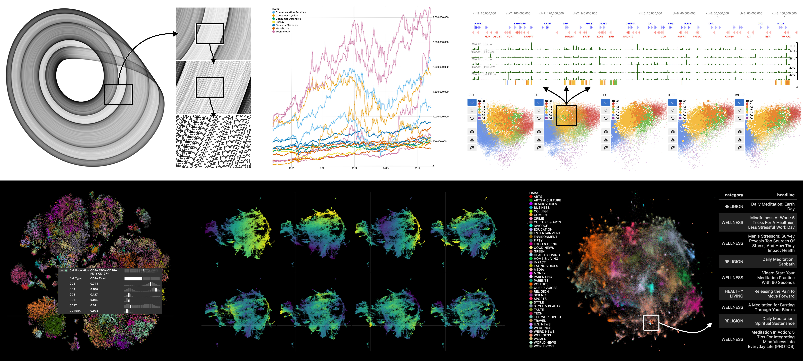

---
title:
  'Jupyter Scatter: Interactive Exploration of Large-Scale Datasets'
tags:
  - Python
  - Jupyter widget
  - scatter plot
  - 2D scatter
  - interactive data visualization
  - embedding plot
  - WebGL
authors:
  - name: Fritz Lekschas
    orcid: 0000-0001-8432-4835
    affiliation: 1
  - name: Trevor Manz
    orcid: 0000-0001-7694-5164
    affiliation: 2
affiliations:
  - name: Ozette Technologies, Seattle, WA, USA
    index: 1
  - name: Harvard Medical School, Boston, MA, USA
    index: 2
date: 1 May 2024
bibliography: paper/refs.bib
---

# Summary

Jupyter Scatter is a scalable, interactive, and interlinked scatter plot widget for exploring datasets in Jupyter Notebook/Lab, Colab, and VSCode. Thanks to its WebGL-based rendering engine [@lekschas2023regl], Jupyter Scatter can render and animate up to several million data points. The widget focuses on data-driven visual encodings and offers perceptually-effective point color and opacity settings by default. For interactive exploration, Jupyter Scatter features two-way zoom and point selections. Furthermore, the widget can compose multiple scatter plots and synchronize their views and selections, which is useful for comparing datasets. Finally, Jupyter Scatter's API integrates with Pandas DataFrames [@mckinney2010data] and Matplotlib [@hunter2007matplotlib] and offers functional methods that group properties by type to ease accessibility and readability.



# Usage Scenario

Jupyter Scatter's primary purpose is to simplify the visual exploration, analysis, and comparison of large-scale bivariate datasets. To achieve this goal, the widget combines smooth rendering of up to twenty million points with fast and observable point selections, Pandas DataFrame [@mckinney2010data] integration, perceptually-effective default encodings, and a friendly API.

In the following, we demonstrate its usage for visualizing the GeoNames dataset [@geonames], which contains data about cities world wide. For instance, to visualize cities by their longitude/latitude and color-code them by continent (\autoref{fig:teaser} Left), we create a `Scatter` widget as follows.

```py
import jscatter
import pandas as pd

geonames = pd.read_parquet('https://paper.jupyter-scatter.dev/geonames.pq')

scatter = jscatter.Scatter(
  data=geonames,
  x='Longitude',
  y='Latitude',
  color_by='Continent',
)
scatter.show()
```

Without having to specify a color map, Jupyter Scatter picks the categorical colorblind-safe palette from @okabe2008color as the `Continent` column is categorical consisting of seven unique values, i.e., the continents. Had we chosen a column with continuous data, Jupyter Scatter would have automatically picked Matplotlib's [@hunter2007matplotlib] _Viridis_ color palette. Furthermore, as shown in (\autoref{fig:teaser} Middle), Jupyter Scatter applies dynamic point opacity by default where the opacity depends on the point density within the field of view. I.e., as one zooms into a sparse area points become more opaque. This is important for large scale scatter plots as one otherwise suffers from either severe over plotting issue when zoomed out or points being barely visible when zoomed in.

Jupyter Scatter offers many ways to customize the point color, size, and opacity encoding. Since it can get a bit overwhelming to configure everything during the construction of the `Scatter` instance, Jupyter Scatter offers topic-specific methods for configuring the scatter plot. For instance, as shown in \autoref{fig:teaser} Right, in the following we choose a static point size of `2` pixels, use dynamic opacity that depends on the point density in the field of view, and color the points by the log-normalized population using Matplotlib's [@hunter2007matplotlib] _Magma_ color palette in reverse order such that dark blue represents highly-populated cities.

```py
import matplotlib
scatter.size(2)
scatter.opacity('density')
scatter.color(by='Population', map='magma', norm=matplotlib.colors.LogNorm(), order='reverse')
```

To aid interpretation of individual points and point clusters, Jupyter Scatter offers support for legends, axis labels, and tooltips. The features can be activated and customized via their respective methods as shown in the following.

```py
scatter.legend(True)
scatter.axes(True, labels=True)
scatter.tooltip(True, properties=['color', 'Latitude', 'Country'], preview='Name')
```

As shown in \autoref{fig:teaser} Right-Bottom, the tooltip can show a point's data distribution in context to the whole dataset and include a text, image or audio-based media preview. For instance, in the above example we decided to show the distribution of the visually encoded color property as well as the `Latitude` and `Country` columns. For numerical properties, the distribution is visualized as a bar chart and for categorical properties the distribution is visualized as a treemap. As the media preview we're showing the city name.


Exploring a scatter plot often involves studying subsets of the points. To select some points, one can either long press and lasso-select points interactively in the plot (\autoref{fig:teaser} Top Right) or query-select points (\autoref{fig:teaser} Bottom Right) as shown below. In this example, we're selecting all cities with a population greater than ten million.

```py
scatter.selection(geonames.query('Population > 10_000_000').index)
```

The selected cities can be retrieved by calling `scatter.selection()` without any argument. The method returns the data record indices, which can then be used to get back the underlying data records.

```py
cities.iloc[scatter.selection()]
```

To automatically register changes to the point selection one can observe the `scatter.widget.selection` traitlet. The observability of the selection traitlet (and many other properties of `scatter.widget`) makes it easy to integrate Jupyter Scatter with other widgets. 

For instance, \autoref{fig:integration} shows a UMAP [@leland2018umap] embedding of the Fasion MNIST dataset [@xiao2017fashion] where points represent images and the point selection is linked to an image widget that previews the selected images.

```py
import ipywidgets
import jscatter

fashion_mnist = pd.read_parquet('https://paper.jupyter-scatter.dev/fashion-mnist-embeddings.pq')

images = ImagesWidget() # Custom widget for displaying Fashion MNIST images

scatter = jscatter.Scatter(
    data=fashion_mnist,
    x='umapX',
    y='umapY',
    color_by='class',
    background_color='black',
)

ipywidgets.link((scatter.widget, 'selection'), (images, 'images'))

ipywidgets.AppLayout(center=scatter.show(), right_sidebar=images)
```


Beyond a single scatter plot, there are several use cases where one might want to compare two or more related scatter plots. In the case of a high-dimensional dataset, for example, one might want to compare different properties of the same data points. One might also choose to embed the high-dimensional dataset and compare different embedding methods. For large-scale datasets one might want to compare different subsets of the same dataset. or entirely different datasets. Jupyter Scatter supports these kinds of comparisons by synchronized hover, view, and point selections via its `compose` method.

For instance, UMAP [@leland2018umap] isn't the only embedding method and it can be interesting to conpare point clusters between different embedding methods. In the following we compose a two by two grid of four embeddings of the Fasion MNIST dataset [@xiao2017fashion] that were created with PCA [@pearson1901], UMAP [@leland2018umap], t-SNE [@vandermaaten2008visualizing], and a convolutional autoencoder [@kingma2013auto]. As illustrated in \autoref{fig:comparison}, the point selection of the four scatter plots is synchronized.  

```py
config = dict(
    data=fashion_mnist,
    color_by='class',
    legend=True,
    axes=False,
    zoom_on_selection=True,
)

pca = jscatter.Scatter(x='pcaX', y='pcaY', **config)
tsne = jscatter.Scatter(x='tsneX', y='tsneY', **config)
umap = jscatter.Scatter(x='umapX', y='umapY', **config)
cae = jscatter.Scatter(x='caeX', y='caeY', **config)

jscatter.compose(
    [(pca, "PCA"), (tsne, "t-SNE"), (umap, "UMAP"), (cae, "CAE")],
    sync_selection=True,
    sync_hover=True,
    rows=2,
)
```

Note, by having set `zoom_on_selection` to `True` and synchronizing the scatters' selection, selecting points in any scatter will automatically select and zoom all scatters to the selected points.


# Statement of Need

Jupyter Scatter is primarily a tool for data scientists to visually explore and compare bivariate datasets. Its ability for two-way point selections and synchronized plots, enable interactive exploration and comparison in ways that is not possible with existing widgets (e.g., ) or requires considerable effort to set up (e.g., ).

Further, due to its usage of traitlets [@traitlets], Jupyter Scatter integrates easily with other widgets, which enables visualization researchers and practitioners to build domain-specific applications on top of Jupyter Scatter. For instance, the _Comparative Embedding Visualization_ widget [@manz2024general] uses Jupyter Scatter to display four synchronized scatter plots for guided comparison of embedding visualizations. [Andrés Colubri’s research group](https://co-labo.org/) is actively working on a new version of their _Single Cell Interactive Viewer_ which will be based on Jupyter Scatter.

# Related Work

There are many Python packages for rendering scatter plots in notebook-like environments. General-purpose visualization libraries like Matplotlib [@hunter2007matplotlib], Bokeh [@bokeh], or Altair [@altair] offer great customizability but do not scale to millions of points. They also don't offer bespoke features for exploring scatter plots and require manual configuration.

More bespoke dataset-centric plotting libraries like Seaborn [@waskom2021seaborn] or pyobsplot [@pyobsplot] require less configuration and make it easier to create visually-pleasing scatter plots but they still fall short in terms of scalability.

Plotly combines great customizability with interactivity and can render scatter plots of up to a million points. However, drawing many more points is challenging and the library also focuses more on generality than dedicated features for scatter plot exploration and comparison. Plotly's WebGL rendering mode is also bound to the number of WebGL contexts your browser supports (typically between 8 to 16) meaning that it can't reader more 8 to 16 plots when using the WebGL render mode. Jupyter Scatter does not have this limitation as it uses a single WebGL renderer for all instantiated widgets, which is sufficient as static figures don't need constant re-rendering and one will ever only interact with a single or few plots at a time. Being able to render more than 8 to 16 plots can be essential in notebook environments as these are often used for exploratory data analysis.

Datashader [@datashader] specializes on static rendering of large-scale datasets and offers unparalleled scalability that greatly exceeds that of Jupyter Scatter. One can also fine-tune how data is aggregated and rasterized. However, this comes at the cost of limited interactivity. While it's possible to interactively zoom into a rasterized image produced by Datashader, the image is just drawn at scale instead of being re-rendered at different field of views. Re-rendering can be important though to better identify patters in subsets of large scatter plots through optimized point size and opacity.

Finally, except for Plotly, none of the tools support interactive point selections, a key feature of Jupyter Scatter. Also, no other library offers direct support for synchronized exploration of multiple scatter plots for comparison.

# Acknowledgements

We acknowledge and appreciate contributions from Pablo Garcia-Nieto, Sehi L'Yi, Kurt McKee, and Dan Rosén. We also thank Nezar Abdennur for his feedback on the initial API design.

# References
